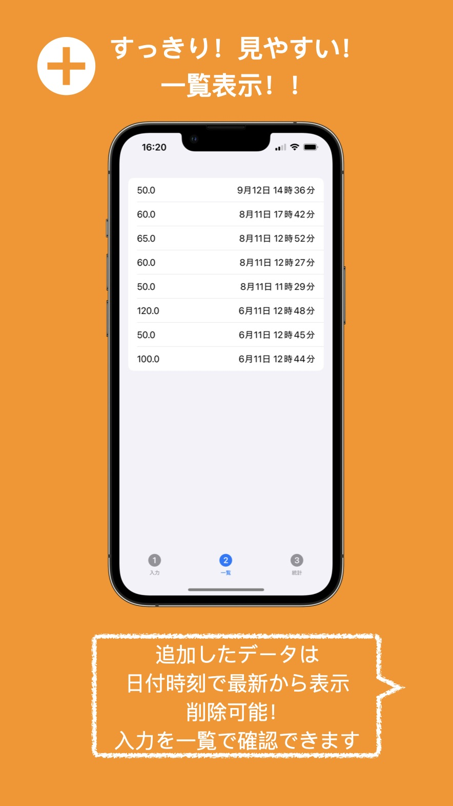

# SimpleData - iOSアプリ

「簡単！シンプル！」をコンセプトにした、自由度の高いデータ入力・管理アプリです。
2025年9月にApp Storeにてリリースされました。

## 📱 アプリ概要
数値の単位をあえて固定しないことで、体重管理、テストの点数、貯金記録など、ユーザーの用途に合わせて自由自在に使用できるのが特徴です。

- **シンプル入力:** 日付とともに数値を素早く記録。
- **一覧表示:** 過去のデータを最新順にリスト表示し、いつでも削除可能。
- **統計機能:** 中央値、平均値、最高・最低値を自動算出。データの傾向を一目で把握できます。

## 📸 スクリーンショット
<table>
  <tr>
    <td></td>
    <td></td>
    <td></td>
  </tr>
</table>

## 🛠 技術スタック
- **Language:** Swift
- **Framework:** SwiftUI

## 👤 リリース
- リリース：2025年9月
- ステータス：2026年6月　App Store公開終了（Developer Program更新停止のため）

---
*このリポジトリは、個人のポートフォリオとして公開しています。*
